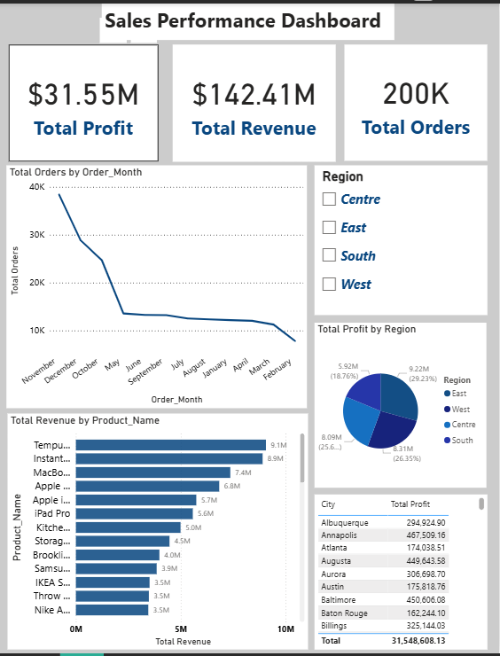
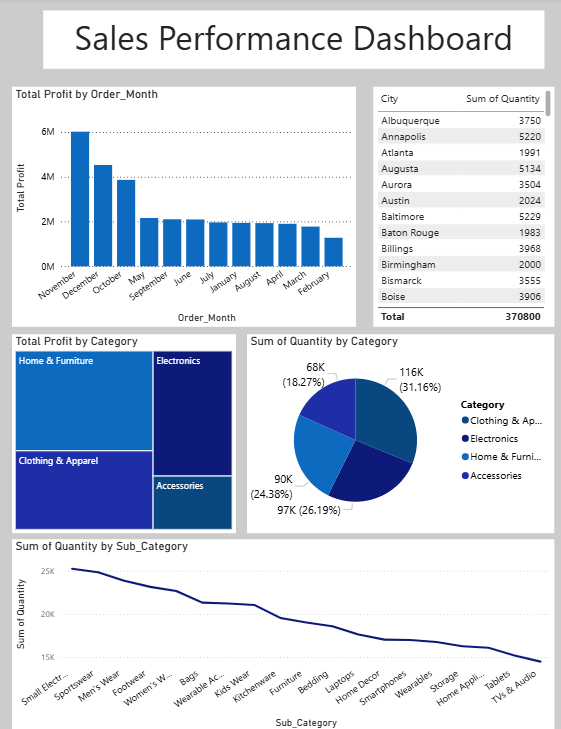

# Sales Performance Dashboard

This project analyzes sales performance data and presents insights through a Power BI dashboard. 
It helps visualize key metrics such as sales trends, top-performing products, and regional performance.

---

## Dataset

The dataset used in this project is located in the `data/` folder.

- **File Name:** `product_sales_dataset_final.csv`  
- **Description:** Contains sales records including date, product, region, sales amount, and other relevant fields.  

---

## Dashboard Preview

Below are screenshots of the Power BI dashboard showcasing the analysis:

  

> Note: Replace these image names with the actual screenshots you have.

---

## How to Use

- Open the Power BI file (`.pbix`) in **Power BI Desktop** to interact with the dashboard.  
- Alternatively, use the dataset in `data/sales_data.csv` to create your own analyses.

---

## Key Insights

- Monthly sales trends  
- Top-selling products  
- Regional performance comparison  

---

## Technologies Used

- **Power BI** for dashboard creation  
- **Excel / CSV** for dataset storage  
- Optional: Any other tools you used for cleaning or analyzing data

---

## Author

- **Your Name**  
- GitHub: [Dhruvmangal970](https://github.com/Dhruvmangal970)
